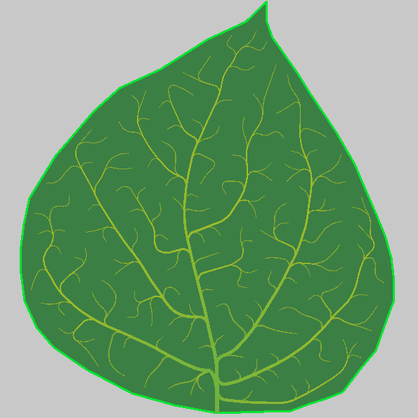

My attempt on modeling and visualizing leaf venation patterns: [link](https://www.algorithmicbotany.org/papers/colonization.egwnp2007.pdf), [link](https://dl.acm.org/doi/10.1145/1073204.1073251)



Build and run:
```
clang -Wall -Wextra -g -ggdb -O0 -ffast-math -march=native -o main main.c -lraylib -lm && ./main
```